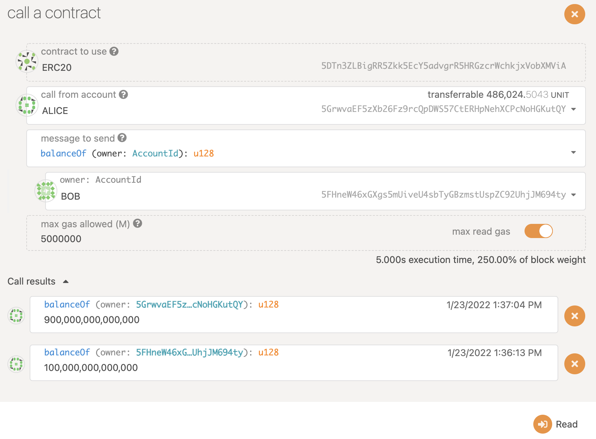
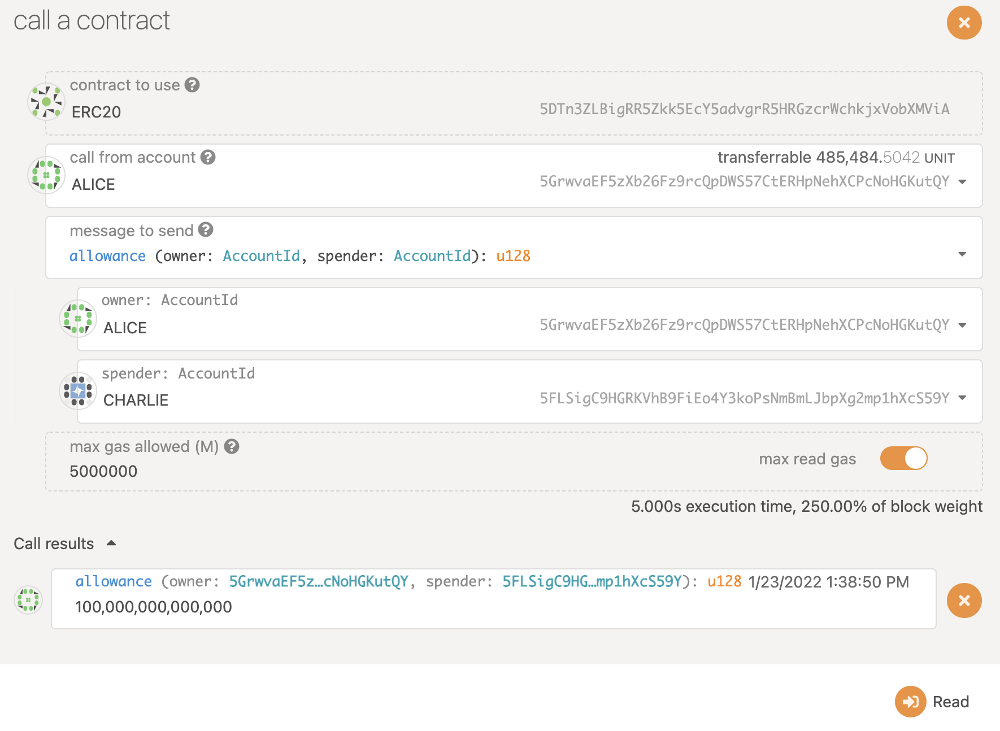

# ERC20 Contract Tutorial

## Contract Compile

The example of the ERC20 contract can be find in [Github/paritytech/ink](<https://github.com/paritytech/ink/tree/ee42309d830b1b4b4f3874c2f53c3f5d6ae9b47f/examples/erc20>) repo.

Clone the repo and compile the ERC20 contract locally


## Node Setup

Build and Run the [substrate-contracts-node](<https://github.com/paritytech/substrate-contracts-node>) locally

```shell
./target/release/substrate-contracts-node --dev --tmp
```

Open the front-end UI ([Polkadot.js](<https://polkadot.js.org/apps/#/contracts>) or [Canvas UI](<https://paritytech.github.io/canvas-ui/#/>)) and connect to the local node


## Deploy and Initialize Contract

Upload the file `erc20.contract`


Initial 1000 supply to Alice (default account)


## Balance

Check the balance after deploying erc20 contract successfully


## Transfer

Alice transfer 100 to Bob


Check the balance after transfer



## Approve and Allowance

Alice approve 300 amount of allowance to Charlie


Check the allowance


Charlie transfer 200 from alice to bob


Check the remaining allowance form Alice to Charlie



Check the balance again

